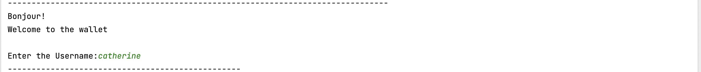

**Gina Cody School of Engineering and Computer Science**

**Department of Electrical and Computer Engineering**

**COEN 6311 - Software Engineering**

**Mini Programming Project**

**Report By**

**Mohamed Nabeel Deen-40226125**

**TABLE OF CONTENTS**

1.  **PROJECT DESCRIPTION 3**

2.  **USER STORY 3**

3.  **DIAGRAM**

    1.  **Timeline 4**

    2.  **Flow Diagram 5**

    3.  **Use Case Diagram 6**

    4.  **Sequence Diagram 7**

    5.  **UML Class Diagram 8**

4.  **OUTPUT OF THE CODE 9-16**

1.  **Project Description**

Building a console wallet for Brad's family where he and his wife Ana
can manage all the purchases done by them and their 8 children. The
wallet is linked to Brad and Ana's bank from which money can be
deposited to the wallet. Brad and Ana can view all the transactions of
the family members listing items, store names, and prices with the
timestamp. Each child will be having a purchase limit of 50\$ per day,
they need to ask permission for every second purchase they do regardless
of the amount of the first purchase. Brad has the privilege to block any
member of the family from using the wallet. Children can request Ana to
approve overpaying more than 50\$, she can accept or reject or transfer
the request to Brad. If the wallet balance is insufficient Brad and Ana
will receive a notification stating, "Wallet balance is below 100\$" and
kids can request a money deposit too.

GitHub URL:
[**https://github.com/MohamedNabeelDeen/Mini_project**](https://github.com/MohamedNabeelDeen/Mini_project)

**Family Usernames:** Dad and Mom: Brad and Ana. Children: Catherine,
David, Eon, Faz, Georgia, Helena, Irene, Jackson.

2.  **User Story**

-   As a father of 8 children, my wife and I need a family wallet linked
    to our bank account from which my wife, myself and my kids can make
    any purchase.

-   As a father, I can view all the transactions with Items purchased,
    and store and price details with the timestamp.

-   As a child, I have a purchase limit of 50\$ per day.

-   As a kid, I request a money deposit if the wallet balance is
    insufficient.

-   As a father, I can block any of my children from using the wallet
    for purchases and unblock them too.

-   As a kid, if I get blocked by my dad from using the wallet I can
    request him to unblock me.

-   As a father, I should receive a notification if the wallet balance
    is below 100\$

-   As a mom, I should receive a notification if the wallet balance is
    below 100\$

-   As a kid, I can only request an overpay from mom if the purchase
    value is more than 50\$.

-   As a mom, I can accept the child\'s overpay request, reject it, or
    transfer it to the dad.

3.  **Diagram**

    1.  **Timeline:**

**3.2 Flow Diagram:**

**3.3 Use case diagram:**

**3.4 Sequence Diagram:**

**3.5 UML Class Diagram:**

4.  **OUTPUT OF THE CODE**

**PARENT**

Login Page

When the user is Father the Home page is shown.

He can choose one of the 8 options

**CASE 1:** if Brad wants to deposit the amount to himself

Brad wants to deposit the amount to one of the child-Catherine

**CASE 2:** if Brad chooses the purchase option

He must enter the Name of the item, the price and the name of the store.

All the details are stored

If the wallet balance is insufficient output will be "Not enough
Balance"

**CASE 3:** View all transaction

**CASE 4:** Current wallet balance

**CASE 5:** The notification option has all the
insufficient wallet balances, overpay requests and Block request

**CASE 6 and CASE 7:** To block and unblock a user which
only the father can do

He must enter the username

**CASE 8:** Logout, back to the login page

**[KID**

Login Page

If the user is a child, the below options are shown.

**CASE 1:** The Child must enter the Name of the item, the
price and the name of the store.

All the details are stored

If the user is blocked by the father (Brad)

Then the user won't be able to purchase-Output "You have been blocked by
Dad"

**CASE 2:** Current wallet balance

**CASE 3:** Requesting for an overpay
**CASE 4:** Logout, back to the login page

